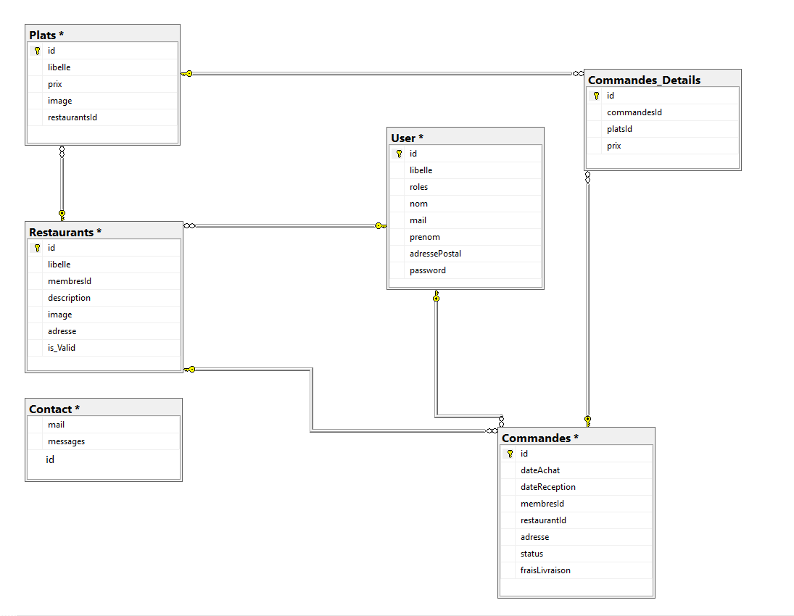

# Base de données :

## Explication :

### Plats type :

Permet de définir le type du plat en question.
Nous l'avons mis dans une autre table afin **d'eviter une répétition ainsi que de simplifier l'administation des types (ajout, modification, suppression).**

### Membres _Histo :

Permet un récapitulatif des divers commandes (prix des plats + frais de livraison) d'un utilisateur.
La table Commande n'est pas suffisante car elle ne prend pas en compte les frais de livraison.
Sachant que les frais de livraison pourront être modifié.

### Parametres :

Contient les frais de livraison afin que l'administrateur puisse les modifier sans nouvelle version du projet nécessaire.

### Commandes_details :

Permet de stocker tous les plats d'une commande.
Nous **sotckons le prix** car si le prix d'un plat change, ça **n'affecte pas l'historique de la commande passée.**

## Explication Relations :

### Relation Membres - Restaurants :

Initialement un membre est un client.
Mais il peut néanmoins **devenir restaurateur tout en restant client.**
**Il devient restaurateur lorsqu'il crée un restaurant.**

